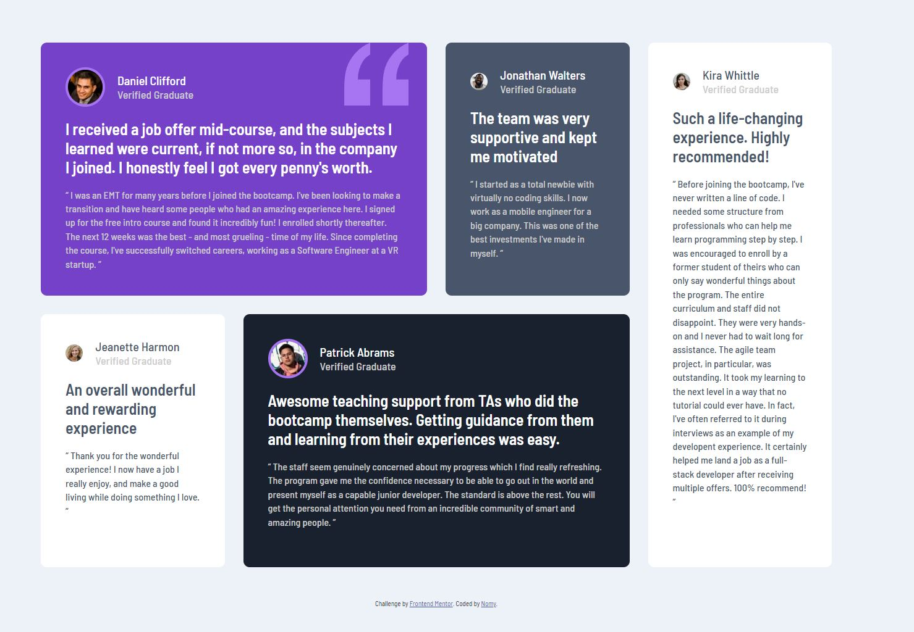

# Frontend Mentor - Testimonials grid section solution

This is a solution to the [Testimonials grid section challenge on Frontend Mentor](https://www.frontendmentor.io/challenges/testimonials-grid-section-Nnw6J7Un7). Frontend Mentor challenges help you improve your coding skills by building realistic projects. 

## Table of contents

- [Overview](#overview)
  - [The challenge](#the-challenge)
  - [Screenshot](#screenshot)
- [My process](#my-process)
  - [Built with](#built-with)
  - [What I learned](#what-i-learned)
  - [Useful resources](#useful-resources)
- [Author](#author)

## Overview

### The challenge

Users should be able to:

- View the optimal layout for the site depending on their device's screen size

### Screenshot

Here is a screenshit of my result : 

## My process

### Built with

- Semantic HTML5 markup
- CSS custom properties
- Flexbox
- CSS Grid
- Mobile-first workflow

### What I learned

This is a first time using grid, and I find it pretty usefull and simple to use for this case. 

### Useful resources

- [An Interative guide to CSS Grid](https://www.joshwcomeau.com/css/interactive-guide-to-grid/) - This helped to understand the grid systeme and to put it in place.

## Author

- Frontend Mentor - [@Nomylim](https://www.frontendmentor.io/profile/Nomylim)
